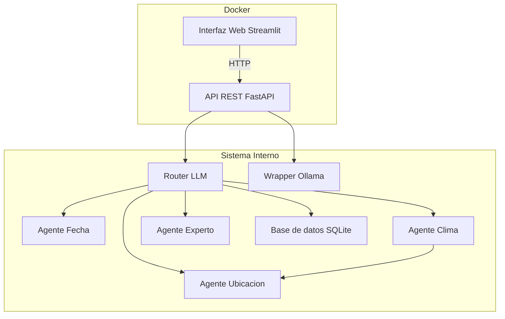

# 🧠 MCP: Multi-Agent Control Point

Este proyecto implementa un servidor multi-agente que enruta preguntas del usuario a un modelo LLM o a agentes especializados (como fecha, ubicación, clima o un experto técnico). Incluye una interfaz web sencilla construida con Streamlit para facilitar su uso.

---



---

## 🚀 Características

- 🌐 Backend con FastAPI
- 🧠 Agentes especializados (fecha, ubicación, clima, experto LLM)
- 🧩 Sistema de agentes extensible y modular con herencia
- ⚙️ Herencia común `AgenteBase` para manejo uniforme de errores y respuestas
- 🤖 Lógica inteligente para que los agentes colaboren entre sí
- 🖥️ Interfaz visual con Streamlit (GUI)
- 🐳 Contenedores Docker para fácil despliegue
- 🔌 Comunicación cliente-servidor lista para red local o remoto

---

## 📁 Estructura del proyecto

```
MCP/
├── core/
│   ├── ollama_wrapper.py       # Encapsula la lógica para interactuar con modelos LLM en Ollama
│   ├── context_loader.py       # Carga contexto adicional desde base de datos u otras fuentes
│   └── router_llm.py           # Router inteligente que decide qué agente usar en base a la consulta
├── agents/                     # Carpeta que contiene todos los agentes disponibles del sistema
├── server/
│   ├── mcp_server.py           # Punto central que gestiona los agentes registrados y el procesamiento de mensajes
│   └── api.py                  # Define la API REST usando FastAPI para comunicación con la GUI u otros clientes
├── gui/
│   ├── app.py                  # Aplicación Streamlit que actúa como interfaz gráfica del sistema
│   └── .streamlit/
│       └── secrets.toml        # Archivo de configuración que contiene la URL del backend para la GUI
├── utils/
│   ├── db_utils.py             # Funciones auxiliares para conectarse y consultar la base de datos SQLite
│   ├── agente_base.py          # Clase base AgenteBase, común a todos los agentes personalizados
│   └── json_parser.py          # Utilidad para dividir respuestas JSON en partes más manejables
├── database/
│   ├── context.db              # Base de datos SQLite con información contextual para los agentes o el LLM
│   ├── comprobar_db.py         # Script que valida la existencia y consistencia de la base de datos
│   └── create_db.py            # Script para generar y poblar la base de datos desde cero
├── config.py                   # Archivo central de configuración del sistema (rutas, modelos, flags, etc.)
├── requirements.txt            # Lista de dependencias de Python necesarias para ejecutar el proyecto
├── Dockerfile.backend          # Dockerfile para construir el contenedor del backend (API + lógica de agentes)
├── Dockerfile.frontend         # Dockerfile para construir el contenedor de la interfaz Streamlit
└── docker-compose.yml          # Archivo para levantar los servicios frontend y backend de forma conjunta

```

---

## ⚙️ Requisitos

- [Docker](https://www.docker.com/)
- [Docker Compose](https://docs.docker.com/compose/)

---

## 🧪 Instalación rápida

### 1. Clona el repositorio

```bash
git clone https://github.com/tu-usuario/MCP.git
cd MCP
```

### 2. Crea archivo de configuración para Streamlit

Dentro del directorio `gui`, crea el archivo:

```
gui/.streamlit/secrets.toml
```

Con el siguiente contenido:

```toml
server_url = "http://backend:8000/process"
```

### 3. Ejecuta con Docker Compose

```bash
docker-compose up --build
```

Esto construirá y levantará dos contenedores:

- Backend en `http://localhost:8000`
- Interfaz gráfica en `http://localhost:8501`

---

## 🌍 Acceso desde otra máquina (opcional)

1. Asegúrate de exponer correctamente los puertos (`8000`, `8501`).
2. Usa la IP de la máquina servidor en lugar de `localhost` en `secrets.toml`.
3. También puedes configurar redes Docker personalizadas para acceso cruzado entre hosts.

---

## 📦 Para producción

Puedes ejecutar solo el backend si deseas integrarlo con otra interfaz:

```bash
docker build -f Dockerfile.backend -t mcp_backend .
docker run -p 8000:8000 mcp_backend
```

---

## ✨ Ejemplo de uso

En la interfaz web, puedes escribir preguntas como:

- `¿Qué día es hoy?`
- `¿Dónde estoy?`
- `¿Qué clima hace?`
- `Explícame qué es Python`

La aplicación decidirá si responder directamente o delegar la pregunta a un agente.

---

## 🛠️ Agentes disponibles

| Agente       | Función                                 |
|--------------|------------------------------------------|
| FECHA        | Devuelve la fecha y hora actuales        |
| UBICACION    | Detecta la ciudad y país mediante IP     |
| CLIMA        | Devuelve el clima en la ubicación actual |

---

## 🔄 Interacción entre agentes

El agente de clima ahora usa directamente el agente de ubicación para determinar coordenadas geográficas (`lat`, `lon`) y ciudad antes de consultar el clima, permitiendo respuestas adaptadas al lugar real del usuario. Esto mejora la modularidad y colaboración entre agentes.

---

## 🧩 Cómo crear un nuevo agente

1. Crea una clase que herede de AgenteBase:

```bash
from agentes.base import AgenteBase

class AgenteEjemplo(AgenteBase):
    patrones = [r"expresiones.*clave", r"otra.*forma.*de.*preguntar"]

    def agente(self) -> dict:
        datos = {"respuesta": "Soy un agente de ejemplo"}
        return {"success": True, "data": datos}
```

2. Especifica los patrones para detectar preguntas relevantes.

3. Implementa `agente()` que devuelve un dict con la clave success y data o error.

4. El agente usará automáticamente el LLM indicado para generar respuestas naturales basadas en su data.

---

## ⚠️ Notas técnicas importantes

- Todos los agentes heredan de AgenteBase, lo que gestiona:

    - Errores estándar

    - Conversión de datos a respuesta natural vía LLM

- El método agente() debe devolver un diccionario estructurado.

- Cada agente especifica qué modelo de LLM utilizar (`llm_simple` o `llm_experto`).

## 📄 Licencia

Este proyecto está licenciado bajo MIT License.

---

## 🙋‍♂️ Autor

Desarrollado por Alejandro Gómez Sierra.
